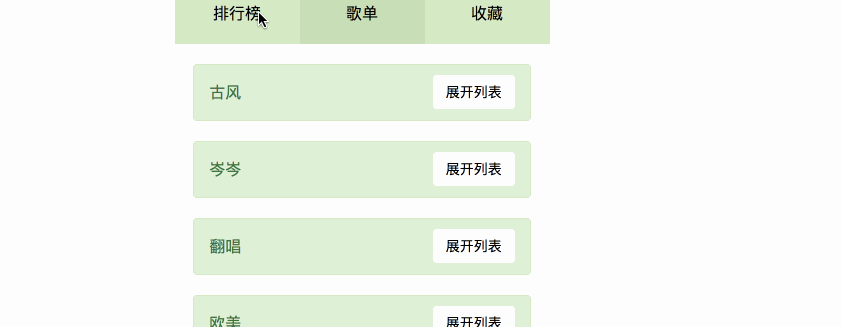

# React Tabs

React实现面板展开折叠效果

# React-vote  React 投票项目

## 1. `使用`

### 下载和安装

* 将项目clone到本地
* 打开命令行输入
```
npm install
```
进行全部依赖安装

#### 由于本项目在webpack.config.js中配置了自动打开浏览器功能 所以不需用户手动开启页面

## 2 `启动项目`

```javascript
npm run dev
```

## 3 `页面`

React单页面应用 所以其实是一个页面进行展示
* 头部按钮的切换

### 排行榜

### 歌单
* 折叠面板部分处理

> 同组之间效果互斥 同级之间彼此互斥

## 4 `效果展示`


